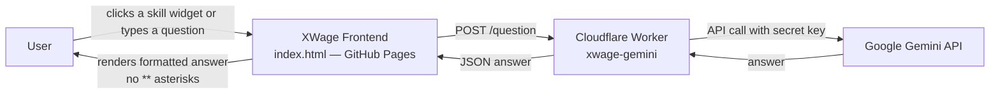

<div align="center">

# XWage — AI Skills Professor

**An agent-style tutor for the 14 AI skills that command the highest wage premiums.**
Grounded in an empirical study of 1,500 job listings. Editorial design. Zero build.

[](https://derrickmirindi.github.io/XWage/)
[](#license)
[](./index.html)
[](https://ai.google.dev/)


</div>

---

## Table of Contents

- [Overview](#overview)
- [The Fourteen Skills](#the-fourteen-skills)
- [Key Wage Premiums](#key-wage-premiums)
- [Features](#features)
- [Architecture](#architecture)
- [Quick Start](#quick-start)
- [Configuration](#configuration)
- [Project Structure](#project-structure)
- [Design System](#design-system)
- [Keyboard Shortcuts](#keyboard-shortcuts)
- [Roadmap](#roadmap)
- [Contributing](#contributing)
- [Authors](#authors)
- [Citation](#citation)
- [License](#license)

---

## Overview

**XWage** is a single-page, editorial-grade web application that acts as an AI professor for job seekers, career researchers, and educators studying the AI-labor market. The interface pairs a Muller-Brockmann modular grid with fourteen interactive skill widgets. Each widget links to the canonical reference for the skill and hands off to an agent (Google Gemini via a Cloudflare Worker) that answers questions in plain, formatted prose.

> The study behind this app measured 1,500 AI-tagged job postings across the US and Canada and estimated the base-salary premium associated with each skill.

<div align="center">


</div>

---

## The Fourteen Skills

Every skill is a widget on the home page with its own icon, wage premium, description, and an **Official reference** link.

| # | Skill | Icon | Wage Premium | Official Reference |
|---|-------|:----:|-------------:|--------------------|
| 01 | System Design |  | **+$61,000** | [System Design Primer](https://github.com/donnemartin/system-design-primer) |
| 02 | Prompt Engineering |  | **+$31,000** | [Prompting Guide](https://www.promptingguide.ai/) |
| 03 | LLM Fine-tuning |  | **+$30,000** | [Hugging Face — Training](https://huggingface.co/docs/transformers/training) |
| 04 | RAG |  | **+$29,000** | [LangChain RAG Tutorial](https://python.langchain.com/docs/tutorials/rag/) |
| 05 | Enterprise Architecture |  | **+$28,500** | [The Open Group — TOGAF](https://pubs.opengroup.org/togaf-standard/) |
| 06 | MLOps |  | **+$28,000** | [ml-ops.org](https://ml-ops.org/) |
| 07 | LangChain |  | **+$28,000** | [LangChain Docs](https://python.langchain.com/docs/introduction/) |
| 08 | Tool Use |  | **+$26,000** | [OpenAI Function Calling](https://platform.openai.com/docs/guides/function-calling) |
| 09 | PyTorch |  | **+$25,000** | [PyTorch Docs](https://pytorch.org/docs/stable/index.html) |
| 10 | Python |  | **+$22,000** | [Python 3 Docs](https://docs.python.org/3/) |
| 11 | Cloud |  | **+$21,000** | [AWS Machine Learning](https://aws.amazon.com/machine-learning/) |
| 12 | SQL |  | **+$18,000** | [PostgreSQL SQL Tutorial](https://www.postgresql.org/docs/current/tutorial-sql.html) |
| 13 | Documentation |  | **+$15,000** | [Diátaxis Framework](https://diataxis.fr/) |
| 14 | Business Analysis |  | **+$14,000** | [IIBA BABOK](https://www.iiba.org/standards-and-resources/babok/) |

---

## Key Wage Premiums

<div align="center">


</div>

---

## Features

- 🧭 **Editorial layout** — a 12-column Muller-Brockmann modular grid, gold-on-paper palette, no gradients.
- 🎛 **Skill widgets** — 14 interactive cards, each with a hand-drawn inline SVG icon, wage figure, description, and an **Official ref** link that opens the canonical source in a new tab.
- 🤖 **AI Agent** — Google Gemini answers questions about any of the 14 skills through a Cloudflare Worker proxy that keeps your API key private.
- 🧹 **Clean answers** — client-side formatter renders Markdown bold, italic, and code as real HTML while stripping stray `**` so no asterisks ever reach the reader.
- ⌨️ **Grid overlay** — press <kbd>G</kbd> to reveal the numbered baseline grid; press again to hide.
- 📱 **Responsive** — a 6-column grid on mobile, single-file, no build step, zero dependencies at runtime.
- 🔒 **Zero secrets in the frontend** — only the Worker URL is exposed.

---

## Architecture



**Frontend** — a single `index.html` served statically. Uses Inter + Space Mono from Google Fonts and inline SVG for every icon. No framework, no bundler, no runtime dependencies.

**Backend** — a Cloudflare Worker (`xwage-gemini.mirindiderick.workers.dev`) that receives `{question}`, prepends a domain-specific system prompt about the 14 skills and the underlying study, calls Gemini, and returns `{answer}`.

---

## Quick Start

```bash
# 1. Clone
git clone https://github.com/Derrickmirindi/XWage.git
cd XWage

# 2. Serve locally (any static server works)
python -m http.server 8080
# or
npx serve .

# 3. Open http://localhost:8080
```

To deploy your own instance, publish the repo to **GitHub Pages** (Settings → Pages → Deploy from `main` branch, root).

---

## Configuration

The only frontend configuration lives at the top of the `<script>` block in `index.html`:

```js
var WORKER_URL = "https://xwage-gemini.mirindiderick.workers.dev/";
```

Point this at your own Cloudflare Worker if you fork the project. A minimal Worker looks like:

```js
export default {
  async fetch(request, env) {
    const { question } = await request.json();
    const prompt = `You are the XWage Agent. Answer plainly, in prose, about the 14 AI skills that command wage premiums. Question: ${question}`;
    const res = await fetch(
      `https://generativelanguage.googleapis.com/v1beta/models/gemini-1.5-flash:generateContent?key=${env.GEMINI_API_KEY}`,
      { method: "POST", headers: { "Content-Type": "application/json" },
        body: JSON.stringify({ contents: [{ parts: [{ text: prompt }] }] }) }
    );
    const data = await res.json();
    const answer = data?.candidates?.[0]?.content?.parts?.[0]?.text ?? "No answer.";
    return new Response(JSON.stringify({ answer }), {
      headers: { "Content-Type": "application/json", "Access-Control-Allow-Origin": "*" }
    });
  }
};
```

Set `GEMINI_API_KEY` as a Worker secret: `wrangler secret put GEMINI_API_KEY`.

---

## Project Structure

```
XWage/
├── index.html      # single-file app: layout, styles, icons, chat
└── README.md       # this file
```

That is the whole project. Everything else — the SVG icon library, the 14-skill dataset, the answer formatter, the grid overlay — lives inside `index.html`.

---

## Design System

| Token | Value | Purpose |
|-------|------:|---------|
| `--paper` | `#f4f3f1` | Page background |
| `--panel` | `#e9e7e3` | Card and bot-message background |
| `--ink` | `#1c1b19` | Body text, dark accents |
| `--ink-soft` | `#6b6862` | Secondary text |
| `--accent` | `#b8860b` | Gold — kickers, hovers, wage figures |
| `--accent-soft` | `#d9b24a` | Soft gold on dark backgrounds |
| `--line` | `#c9c6c0` | Hairlines and card borders |
| Grid | 12 cols · 24 px gutter · 8 px baseline · 24 px line height | Modular grid |
| Type | Inter (display + body) · Space Mono (labels, code) | Two typefaces only |

Optical alignment is computed at runtime from a `<canvas>` measurement so the first ink of the display type sits on the left grid line, not its bounding box.

---

## Keyboard Shortcuts

| Key | Action |
|-----|--------|
| <kbd>G</kbd> | Toggle the numbered grid overlay |
| <kbd>Enter</kbd> | Send the current question |

---

## Roadmap

- [ ] Publish the underlying dataset (1,500 postings, cleaned) as a CSV release
- [ ] Add a **/methodology** page explaining the premium estimator
- [ ] Streamed responses (SSE) for token-by-token answers
- [ ] Bilingual UI (EN / FR)
- [ ] Downloadable "skill card" PDFs (one per skill, print-ready)

---

## Contributing

Pull requests are welcome. Please keep the project true to its constraints:

1. **Single file** — everything ships in `index.html`.
2. **No build step, no runtime dependencies.** Google Fonts is the only allowed remote.
3. **No gradients, no drop shadows.** The palette is grey and gold.
4. **Grid discipline** — every new element must line up on the 12-column, 8 px baseline grid.

Before pushing, verify:
- Cards line up on the grid at both desktop and mobile breakpoints.
- The agent's answers never contain visible `**` or stray asterisks.
- All official reference links open in a new tab (`target="_blank" rel="noopener noreferrer"`).

---

## Authors

**Mirindi · Sinkhonde · Mirindi** — research, design, and engineering.

- [@Derrickmirindi](https://github.com/Derrickmirindi)

---

## Citation

If you cite XWage in academic work, use:

```bibtex
@misc{xwage2026,
  title  = {XWage: An Agent-Style Tutor for the AI Skills Wage Premium},
  author = {Mirindi, D. and Sinkhonde, D. and Mirindi, F.},
  year   = {2026},
  url    = {https://github.com/Derrickmirindi/XWage}
}
```

---

## License

**Research and educational use only. Do not sell this product.**

The dataset, wage-premium estimates, and prose in this repository are provided for research and teaching. Redistribution for commercial purposes is not permitted.

<div align="center">

—


</div>
